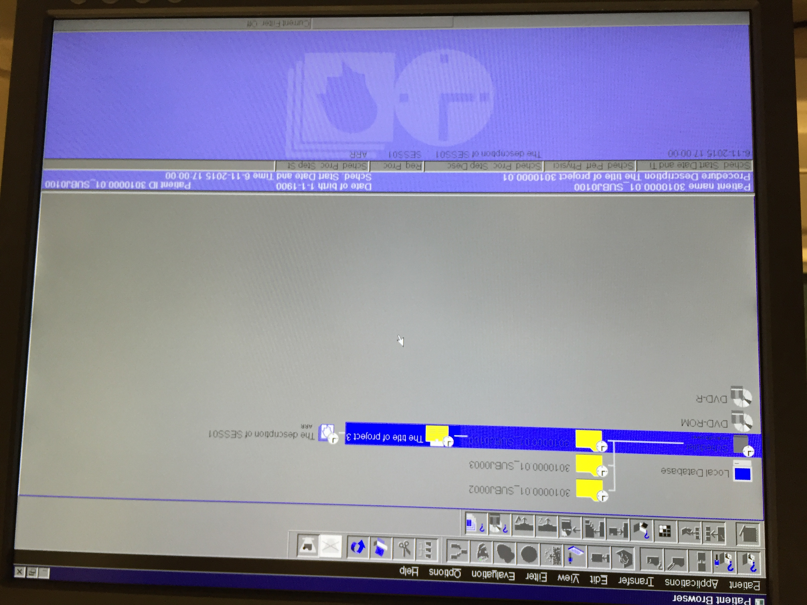

The following example is the minimum worklist fields for PRISMA scanner:

```
(0010,0010) PN  [3010000.01_SUBJ0100]             # Patient Name: This is the mandatory field
(0010,0020) LO  [3010000.01_SUBJ0100]             # Patient ID (combination of project id and subject id)
(0020,000d) UI  [12349]                           # Study Instance ID, should be a number and unique (system generated)
(0032,1032) PN  [MARCEL ZWIERS]                   # RequestedPhysician (the one who book the lab)
(0032,1060) LO  [The title of project 3010000.01] # RequestedProcedureDescription
(0040,1001) SH  [SESS01]                          # RequestedProcedureID, this is mapped to StudyID in DICOM header, and the Study of DICOM is what DCCN researcher calls "session"
(0040,0100) SQ                       
(fffe,e000) -
(0008,0060) CS  [MR]
(0040,0001) AE  [PRISMA]
(0040,0002) DA  [20151106]
(0040,0003) TM  [170000]
(0040,0009) SH  [3010000.01_S01]     # max. 16 chars.
(0040,0010) SH  [PRISMA]
(0040,0011) SH  [DCCN]
(0040,0007) LO  [The description of SESS01]
(0040,0008) SQ
(fffe,e0dd) -
(fffe,e00d) -
(fffe,e0dd) -
```

The resulting console screenshot is shown below:



The archive tarball retrieved from Orthanc will be named as `<PatientID>_<StudyID>.tgz`; and that file should be transferred into `/project/<project_id>` where th `<project_id>` is extracted from the `<PatientID>`.
